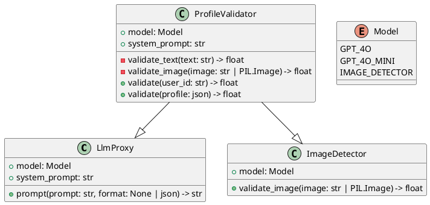

# profile-validation
Validate fake AI accounts by calculating a credibility score by analyzing user profiles

## Environment Setup
1. Install miniconda: https://docs.anaconda.com/miniconda/
   1. Posibly requires adding `conda` command to path

2. Create new conda env w/ python 3.10 called `cs130`
```
conda create -n cs130 python=3.10
```

3. Activate conda env (different on windows)
```
conda activate cs130
```

4. Install requirements
```
pip install -r requirements.txt
```

### Good to Go!

---


## Docs
- AI Image Detection Model: https://huggingface.co/spaces/umm-maybe/AI-image-detector
  - HuggingFace Associated Space: https://huggingface.co/spaces/Organika/sdxl-detector
- OpenAI API Docs: https://platform.openai.com/docs/api-reference/chat/create


## \[UML\] Class Diagram
Requires Code extension [Markdown PlantUML Preview by myml](https://marketplace.visualstudio.com/items?itemName=myml.vscode-markdown-plantuml-preview) to render.


